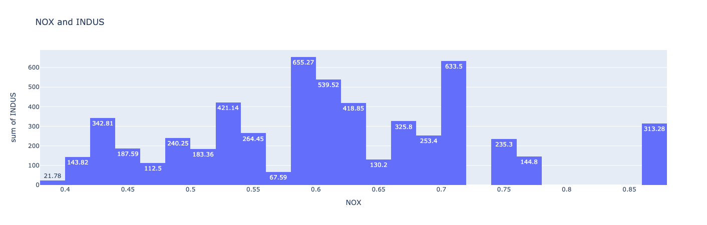
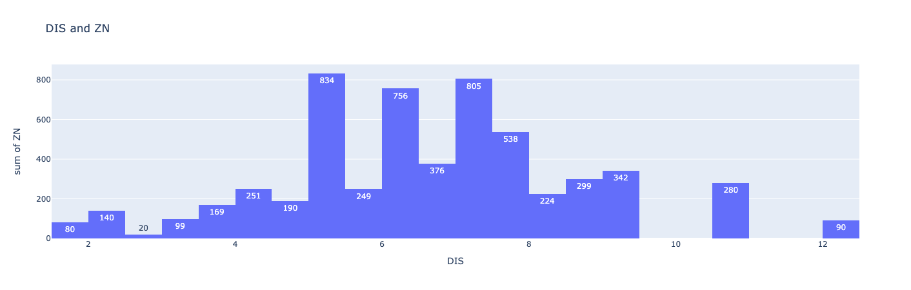
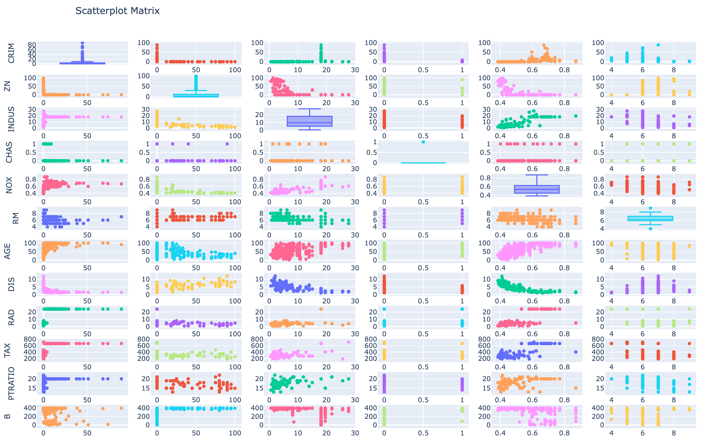

# 02-Data-Science-My-Tu-Verras

## Task

The task is to make house price predictions

# Description

This code was trained on a dataset about apartments in Boston. Actually, this code is machine learning based on the `sklearn` library, it predicts the prices of apartments in Boston.








## Installation

Before work you must install the necessary libraries

```
pip3 install pandas
pip3 install numpy
pip3 install scikit-learn
pip3 install plotly-express
```
## Usage

Download all the necessary files, specify these files and run the code. The program will do everything itself and display all the necessary diagrams for market analysis

## Help

If you have any questions you can write to me by email

> mirabbosminavarov@gmail.com